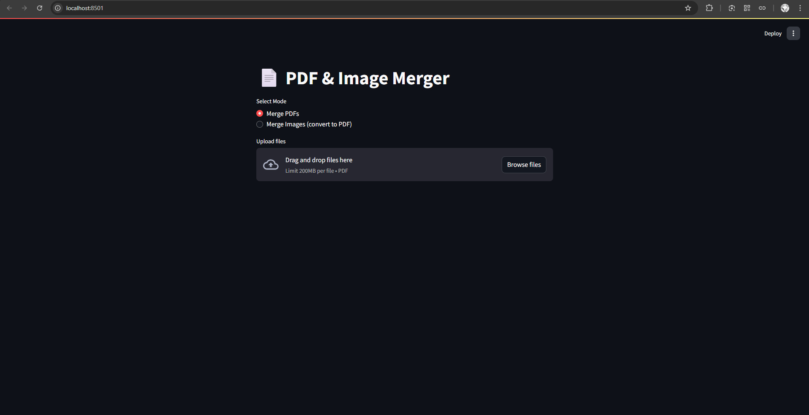

# 📄 PDF & Image Merger

A simple and elegant Streamlit app to merge PDF files or convert multiple images into a single PDF.  
Supports drag & drop, file reordering, and instant download.



---

## 🚀 Features

- 📑 Merge multiple PDF files into a single document
- 🖼️ Convert images (JPG, PNG, BMP, TIFF) into a PDF
- 🔀 Drag-and-drop style reordering
- 💾 Set output filename and directory
- 📥 Download result directly from the web UI
- 🌓 Dark theme (Streamlit native)

---

## 📁 Folder Structure
```bash
pdfConverter/
├── main.py     # Main Streamlit application
├── app.png     # Screenshot of the app (used in README)
└── README.md   # Project documentation
```
---

## 🧰 Requirements

- Python 3.8+
- pip

---

## 📦 Installation

Clone and install dependencies:

```bash
git clone https://github.com/MashiroX00/pdfConverter.git
cd pdfConverter
pip install streamlit PyPDF2 Pillow
streamlit run main.py
```
Then open http://localhost:8501 in your browser.

## Usage Guide
```bash
1.Choose Merge PDFs or Merge Images (convert to PDF)
2.Upload multiple files
3.Reorder the files using the dropdown
4.Set output filename and output directory
5.Click Process
6.Download the merged PDF file
```
## Notes
Images are converted to RGB for compatibility with the PDF format
Output file is saved to the path you choose and is also downloadable directly

## License
This project is licensed under the MIT License.

## Deployment
This porject is deloyment on steamlit
```https

```